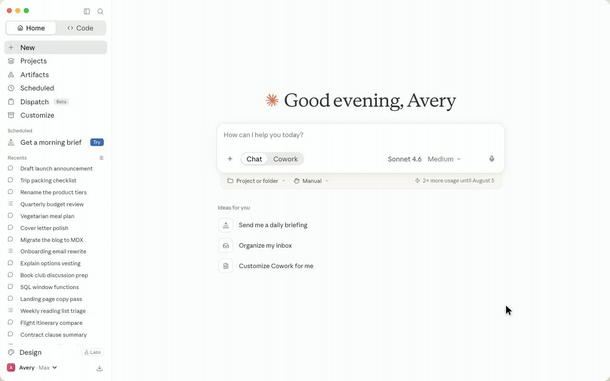
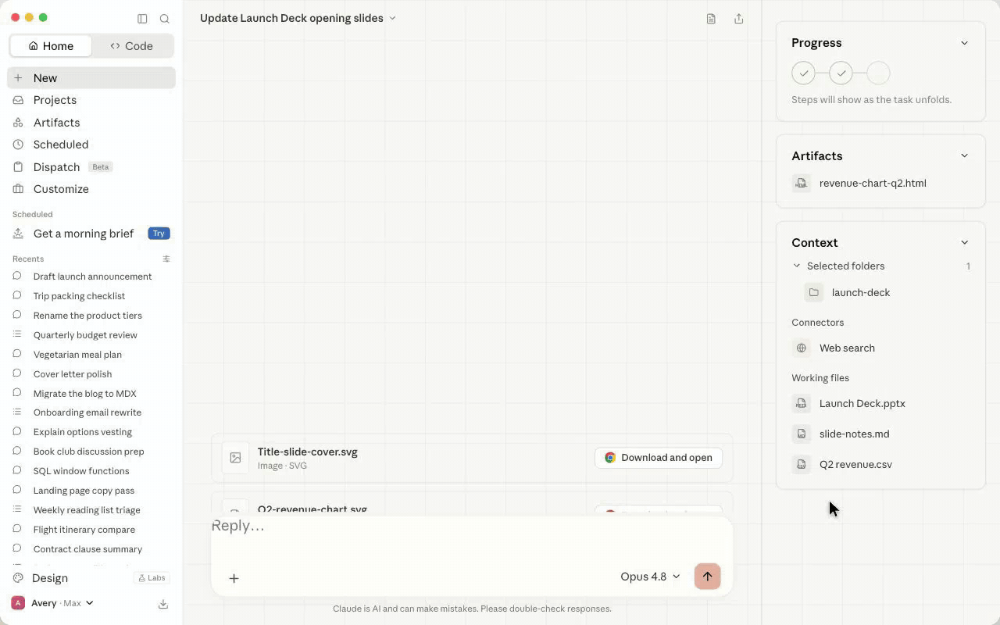
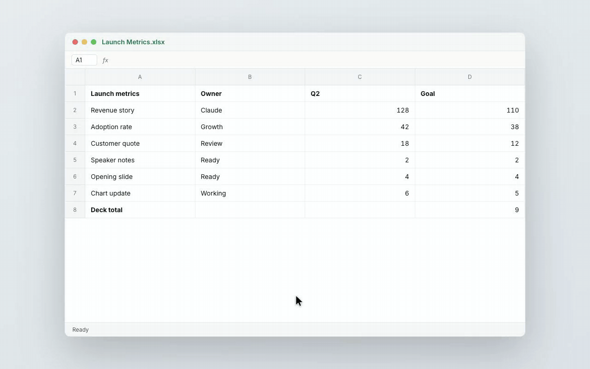
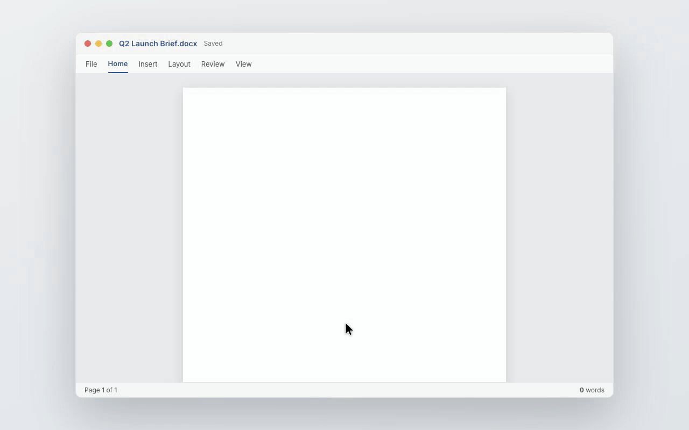
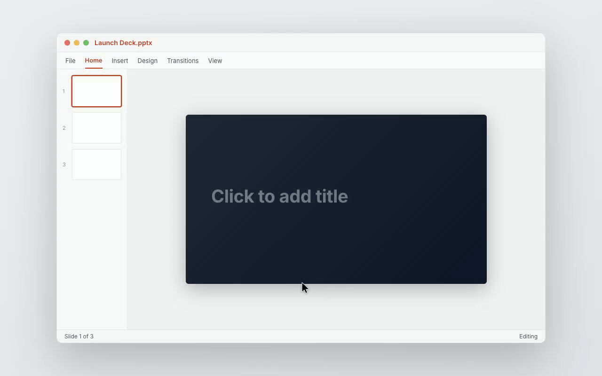
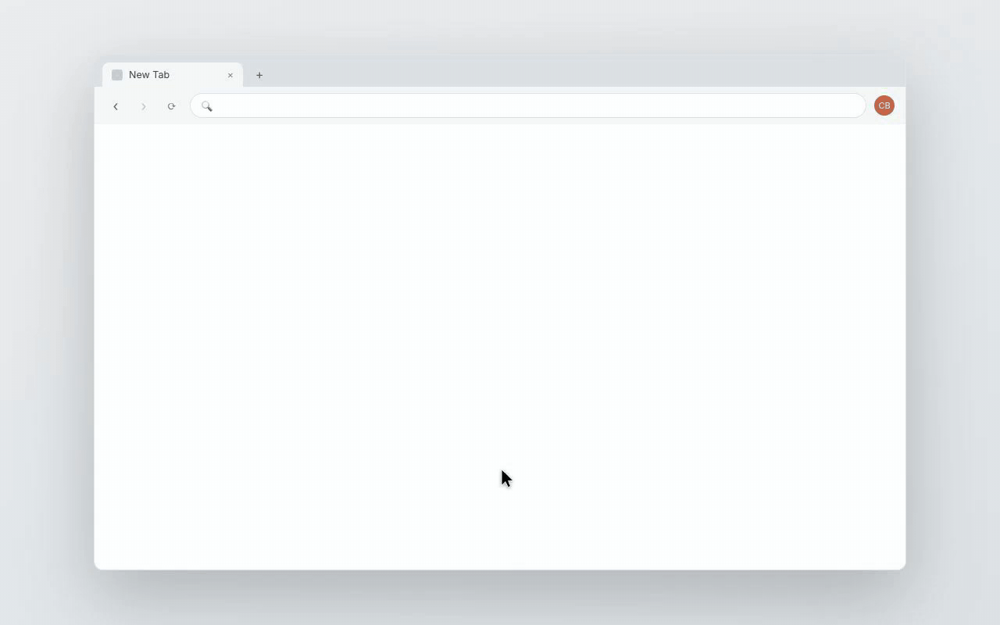
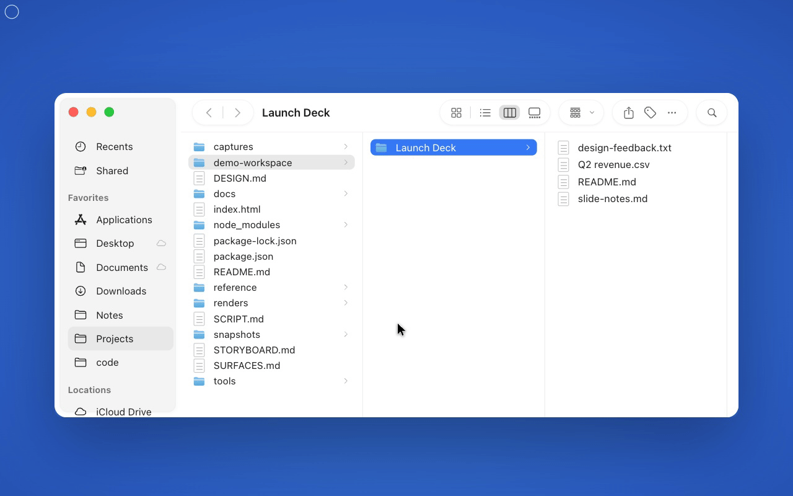
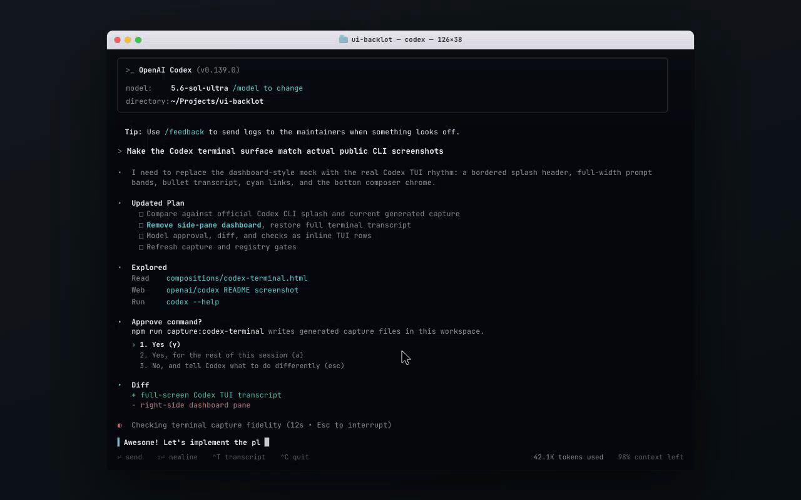
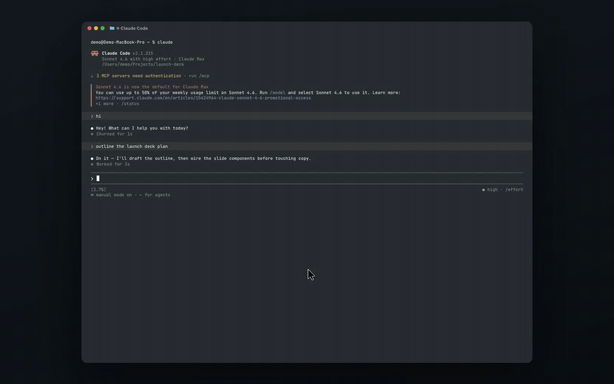

# UI Backlot

**Editable software sets for product-demo videos.** UI Backlot rebuilds the
apps you want to show — Claude, Codex, macOS, Excel, Word, PowerPoint, Figma,
Premiere, browsers — as high-fidelity, scriptable HTML surfaces, then renders
demos with [HyperFrames](https://hyperframes.heygen.com) instead of screen
recordings. Change one line of copy, re-render, done: no retakes, no fragile
live captures.

The long-term vision is in [VISION.md](VISION.md). Agents start with
[CLAUDE.md](CLAUDE.md) / [AGENTS.md](AGENTS.md); external consumers start
right here.

## Demos

Everything below is a **rendered HyperFrames scene** — no screen recording. Real
app surfaces, a real macOS pointer, and scripted interactions (typing, clicking,
streaming replies), rendered deterministically frame by frame.


<sub>A cursor pulls the Claude app up from the dock, then opens Excel on top — real dock icons, real pointer, full app ribbons.</sub>

### App interactions

Scripted with [`runtime/backlot-interactions.js`](runtime/backlot-interactions.js)
— a few lines per action ([authoring guide](#scriptable-interactions)). Worked
examples live in [`examples/*-interaction.html`](examples/).

<table>
<tr>
<td width="50%"><b>Claude — chat</b><br><br><sub>Type a prompt → send → thinking → streamed reply.</sub></td>
<td width="50%"><b>Claude — cowork</b><br><br><sub>Prompt → a tool card runs → progress steps → streamed reply.</sub></td>
</tr>
<tr>
<td><b>Excel</b><br><br><sub>Select a cell, type <code>=SUM(C5:C7)</code>, the result reveals.</sub></td>
<td><b>Word</b><br><br><sub>The title types, body paragraphs stream, word count ticks up.</sub></td>
</tr>
<tr>
<td><b>PowerPoint</b><br><br><sub>Click the title box, type the slide title, save.</sub></td>
<td><b>Browser</b><br><br><sub>Type a URL, a loading bar sweeps, the page loads.</sub></td>
</tr>
<tr>
<td><b>Finder</b><br><br><sub>The real column-view Finder component — select files.</sub></td>
<td><b>Codex CLI</b><br><br><sub>Type a command, stream the terminal output.</sub></td>
</tr>
<tr>
<td><b>Claude Code CLI</b><br><br><sub>Type a command — tool calls and a summary stream in.</sub></td>
<td></td>
</tr>
</table>

## Use the surfaces in your own project

UI Backlot publishes a **HyperFrames registry** — install any surface into your
own HyperFrames project and its dependencies (foundation CSS, fonts, runtime,
composed parts) come with it. Tell your coding agent:

> Add `"registry": "https://raw.githubusercontent.com/conmeara/ui-backlot/main/registry"`
> to my `hyperframes.json`, browse
> [`registry.json`](https://raw.githubusercontent.com/conmeara/ui-backlot/main/registry/registry.json)
> for available blocks, then `npx hyperframes add <name>` what the demo needs
> and wire the printed snippets into my composition.

```bash
# one surface (foundation CSS + fonts install automatically)
npx hyperframes add excel-workbook

# a "Claude working in Excel on a Mac" scene = three blocks you stack yourself
npx hyperframes add mac-menu-bar
npx hyperframes add excel-workbook
npx hyperframes add claude-chat-pane
```

Each `add` prints a ready-to-paste `data-composition-src` snippet — scenes are
composed by stacking blocks in your own composition, not installed pre-baked
(the `mac-multi-app` example below shows the full pattern). Blocks tagged
`dark-mode-ready` switch themes with `class="theme-dark"` on the composition
root; parameterized surfaces expose their states as attributes
(`claude-composed-app` takes `?page=chat|cowork|code`, `claude-cinematic`
takes `?beat=prompt|reply|complete`).

**Complete starter projects** ship as fully-vendored examples (the CLI's
`init --example` only reads the official registry, so scaffold with degit):

```bash
npx degit conmeara/ui-backlot/registry/examples/mac-multi-app my-video
cd my-video && npx hyperframes render --composition index.html --quality draft
```

Agents: [`llms.txt`](llms.txt) has the machine-readable version of this
section. The registry is regenerated from
[`surfaces/registry.json`](surfaces/registry.json) by
`npm run registry:hf:generate` and validated by `npm run registry:hf:check`.

## Run this repo

```bash
npm install
npm run catalog:generate      # regenerate the surface catalog
npm run registry:check        # validate the surface inventory
npm run capture:quickstart-demo
npm run example:quickstart:render   # ~14s draft video in renders/
```

The quickstart composition is
[examples/quickstart-demo.html](examples/quickstart-demo.html) — macOS menu
bar + browser surface + Claude chat pane. The full gate before a PR:

```bash
npm run open-source:check     # catalog + registries + lint + validate + inspect
```

Browse everything visually:

```bash
npm run review                # builds workspace/gallery.html + compare.html, serves on :4173
```

## Find a surface

- **[Hosted catalog](https://conmeara.github.io/ui-backlot/)** — browse every
  surface visually with thumbnails, demo GIFs, and copyable install commands
  (GitHub Pages from [docs/index.html](docs/index.html); regenerate with
  `npm run pages:catalog`).
- [docs/catalog.md](docs/catalog.md) — generated catalog, grouped with a
  selection recipe for agents.
- [surfaces/registry.json](surfaces/registry.json) — the authoritative
  inventory: source file, import selector, capture command, provenance, and
  asset decision per surface.
- [docs/guides/build-hyperframes-demo.md](docs/guides/build-hyperframes-demo.md)
  — composing a demo from tracked components.

## Scriptable interactions

`runtime/backlot-interactions.js` scripts realistic UI actions — typing,
clicking, sending a chat, streaming an AI reply — onto the HyperFrames
timeline. Because HyperFrames renders by **seeking** the timeline (and GSAP
suppresses callbacks like `onUpdate` on seek), every reveal is done with an
interpolated **property** (opacity/transform), so it scrubs frame-accurately.
Text types/streams via per-character opacity stagger, not a callback.

Author a demo in a few lines:

```html
<script src="https://cdn.jsdelivr.net/npm/gsap@3.14.2/dist/gsap.min.js"></script>
<script src="../runtime/backlot-interactions.js"></script>
<script>
  const tl = gsap.timeline({ paused: true });
  const ix = BacklotInteractions.create(tl, {
    root: stage, cursor: ".demo-cursor", ring: ".demo-click-ring",
  });
  ix.type(".composer-input", "Summarize the Q2 deck", { at: 1.5, cps: 22 })
    .click(".send-button", { at: 4.2 })
    .send({ from: ".composer-input", into: ".thread", text: "…", at: 4.4 })
    .think(".thinking", { at: 4.8, dur: 1.0 })
    .stream(".ai-response", "Here are the takeaways…", { at: 5.9, cps: 48 });
  window.__timelines["my-demo"] = tl;
</script>
```

Actions: `moveTo` · `click` · `type` · `stream` · `send` · `show` · `hide` ·
`think` · `press`. Rules: text targets start empty (use a separate placeholder
element and `hide()` it); state flips use `tl.set(el, { attr: { class } })`
(seek-safe), never `.call()`. Worked examples live in
`examples/*-interaction.html`. Render with
`npx hyperframes render --composition examples/<name>.html --quality draft --low-memory-mode`.
Details: [docs/interactions-system-plan.md](docs/interactions-system-plan.md).

## The self-improving loops

Real apps keep changing, so the backlot maintains itself through agent
workflows rather than manual upkeep. Surfaces are held to a **measured** bar:
dated ground-truth reference sets live in `reference/<family>/<date>/`
([reference/sources.json](reference/sources.json) declares how each family is
acquired), and `npm run fidelity:score` writes ranked deltas to
`reports/fidelity/` — fixes are made from measured deltas, never from memory
of what an app looks like.

Three multi-agent workflows (run via the Workflow tool; see
[AGENTS.md](AGENTS.md)):

- **fidelity-push** — a scored pass over every surface family: deterministic
  Score → design Critique (fed the measured deltas) → Fix rounds with
  capture-verify → an adversarial Judge that enforces the score bar and runs a
  **stranger test** (a fresh-context judge must pick the real app from
  real-vs-rebuilt pairs; its tells become the next round's work) → full gates.
- **onboard-app** — the front door for a net-new app family (args
  `{family, title, urls}`): reference research → dated ground-truth capture →
  measured spec → build → adversarial judge → registration everywhere.
- **interaction-push** — the motion counterpart (args `{demos}`): renders each
  interaction demo, extracts frames, and holds the recording to a motion judge
  (state coherence, cursor believability, pacing, a stranger-recording test)
  with repair rounds before the GIF ships.

Loop artifacts land in `workspace/` (gitignored), and two self-contained review
pages make them inspectable — `npm run review` serves
`workspace/compare.html` (reference vs current side by side, plus the latest
pass's applied changes) and `workspace/gallery.html` (the catalog by app
family, with variants and demo GIFs). Both inline their media, so agents can
also publish them as Claude Code Artifacts for remote monitoring during long
passes.

```bash
# capture a public live page into a dated reference set
npm run reference:capture -- https://example.com --family <fam> --label web-app

# score a surface against measured ground truth
npm run fidelity:score -- --label <name> \
  --ours captures/surface-<id>/capture.json \
  --theirs reference/<fam>/<date>/<label>/tokens.json
```

## Contributing

See [CONTRIBUTING.md](CONTRIBUTING.md) — setup, the surface checklist, and the
PR gates. The docs index is [docs/README.md](docs/README.md); design language
lives in [docs/design-language.md](docs/design-language.md).

## License, trademarks & third-party assets

- Code and hand-built surfaces: [ISC](LICENSE).
- The surfaces are **original HTML/CSS recreations** of real product UIs,
  made for instructional and demonstrative purposes (fair use). All product
  names, logos, and brands are property of their respective owners; their use
  here does not imply endorsement. The full attribution register — every icon
  set, font, donor repo, and capture source with its license — is
  [RESOURCES.md](RESOURCES.md).
- Privacy is the one hard constraint: contributors' own logged-in captures
  stay local (gitignored); tracked surfaces use synthetic demo content.
